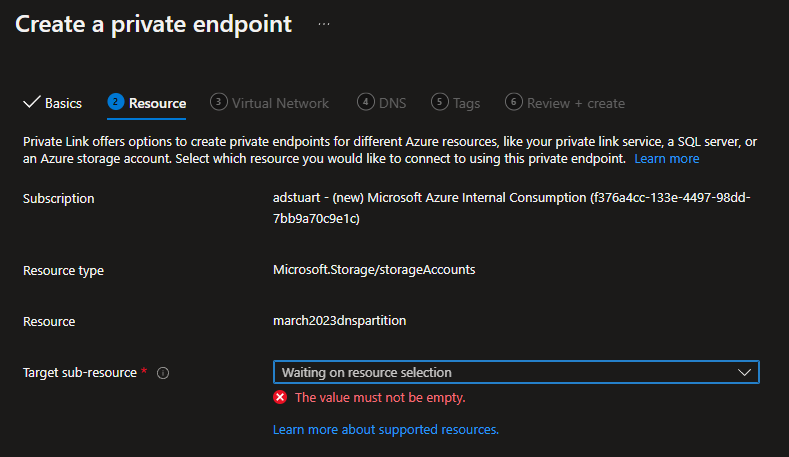
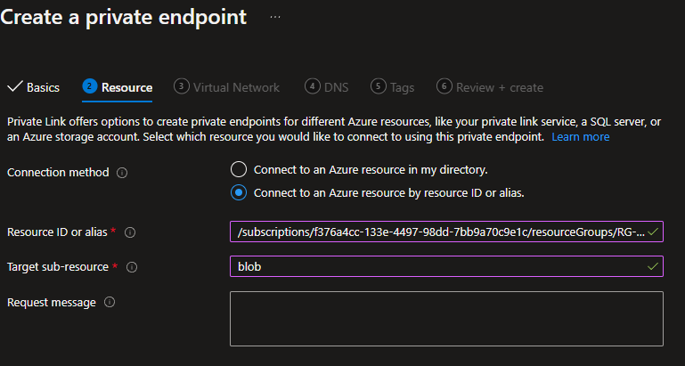
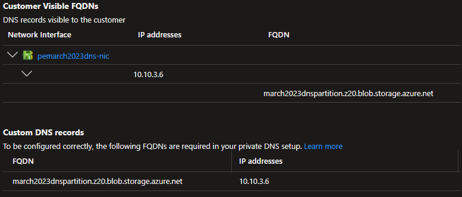
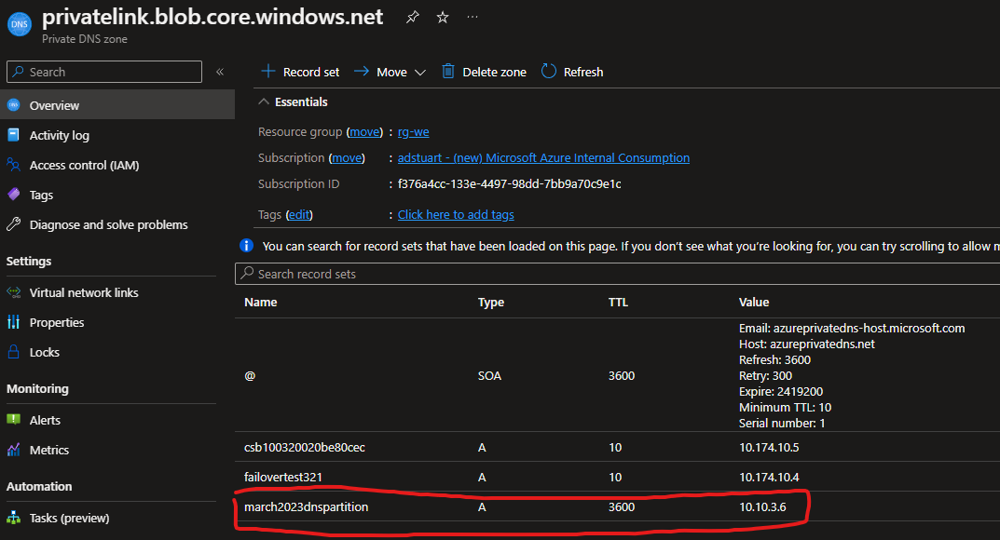

# Using Azure Private Link with PartitionedDns enabled Azure Storage accounts

A short guide detailing how to enable Private Endpoints for Azure Storage accounts using the new DNS partition feature.

Official blog post and context on why you may want to use this feature (in preview at time of writing, March 2023) - https://techcommunity.microsoft.com/t5/azure-storage-blog/public-preview-create-additional-5000-azure-storage-accounts/ba-p/3465466

Official docs - https://learn.microsoft.com/en-us/azure/storage/common/storage-account-overview#azure-dns-zone-endpoints-preview

## DNS changes

Generally when you deploy a storage account, we get a predefined endpoint in the format of:

> myaccountname.blob.core.windows.net 

With this new feature, your end up with a new format, e.g.:

> myaccountname.z18.blob.storage.azure.net

This subtle change in DNS prefix creates a hurdle for Azure DNS Private Zones integration, when using Private Link. Note that [here](https://learn.microsoft.com/en-us/azure/private-link/private-endpoint-dns#azure-services-dns-zone-configuration) within the official Azure Private Link FQDN list, we only specify zones for _privatelink.blob.core.windows.net_ which would not match our suffix when using this feature of _myAccountname.[dnszone].[service type].storage.azure.net_ wherein [dnszone] can range from z00 to z99.

## Create your Storage Account

Register for the preview, and create your storage account with the feature flag enabled. 

```
adam [ ~ ]$ az extension add -n storage-preview
adam [ ~ ]$ az storage account create -n march2023dnspartition -g RG-WE -l westeurope --dns-endpoint-type AzureDnsZone
```

Note the output with flag enabled and new syntax suffix.

```
...
"dnsEndpointType": "AzureDnsZone",
...
"primaryEndpoints": {
    "blob": "https://march2023dnspartition.z20.blob.storage.azure.net/",
```

## Portal UI for Storage Account PE creation is broken

Note if you navigate to your newly formed Storage Account in the portal, and try and create a Private Endpoint from the Networking blade, this will fail, even if using the custom portal URL for this feature.



## Create Private Endpoint manually via Resource ID

Instead we can navigate to the standard PL creation experience in the portal, and specify the Resource ID of our storage account, with required sub-resource (e.g. Blob).



This will not allow you to automagically generate the required Azure DNS Private Zone, therefore we have to fix the DNS.

## Azure DNS Private Zones

Note how the PE is create successfully, but we lack the required Azure Private DNS zone config to get this working in an automated fashion (without manually editing host records).



### Azure Public DNS CNAME

The normal Private Link CNAME insertion still happens in Public DNS when you associate the Private Endpoint to the storage account. We can verify this be querying the FQDN of our Storage Account:

```
march2023dnspartition.z20.blob.storage.azure.net. 60 IN	CNAME march2023dnspartition.privatelink.blob.core.windows.net.
march2023dnspartition.privatelink.blob.core.windows.net. 60 IN CNAME blob.ams09prdstr07a.store.core.windows.net.
blob.ams09prdstr07a.store.core.windows.net. 60 IN A 20.60.223.100
```

### Update Private DNS zone

To fix this, we manually create an A record in our (likely already pre-existing) Azure Private DNS zone used for privatelink.blob.core.windows.net



## Problems?

If you created another Storage Account (or many more) (probably you are, if you are using this feature) then what happens if you get an account with the FQDN:

> march2023dnspartition.z99.blob.storage.azure.net

Well now we have a problem, because this would also CNAME to the same privatelink FQDN e.g.

```
march2023dnspartition.z99.blob.storage.azure.net. 60 IN	CNAME march2023dnspartition.privatelink.blob.core.windows.net.
march2023dnspartition.privatelink.blob.core.windows.net. 60 IN CNAME blob.ams09prdstr07a.store.core.windows.net.
blob.ams09prdstr07a.store.core.windows.net. 60 IN A 20.60.223.100
```

This is never an issue, because the initial storage account name string always has to be unique, so regardless of the dnszone number (1-99) we always get a unique CNAME, and therefore unique A record in privatelink.blob.core.windows.net, despite the initial FQDN coming from a differnet public zone format.